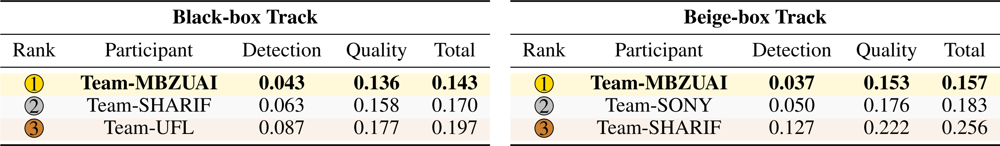
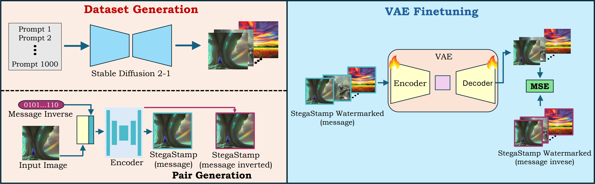
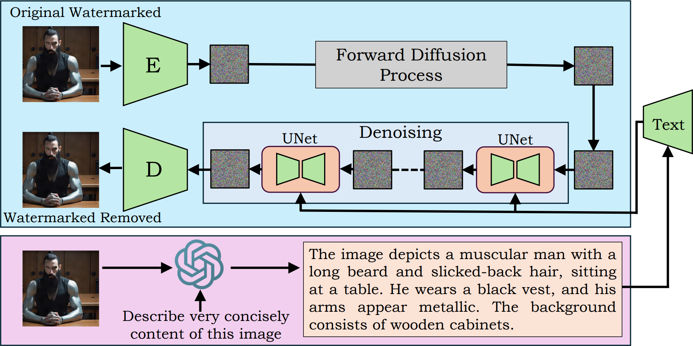
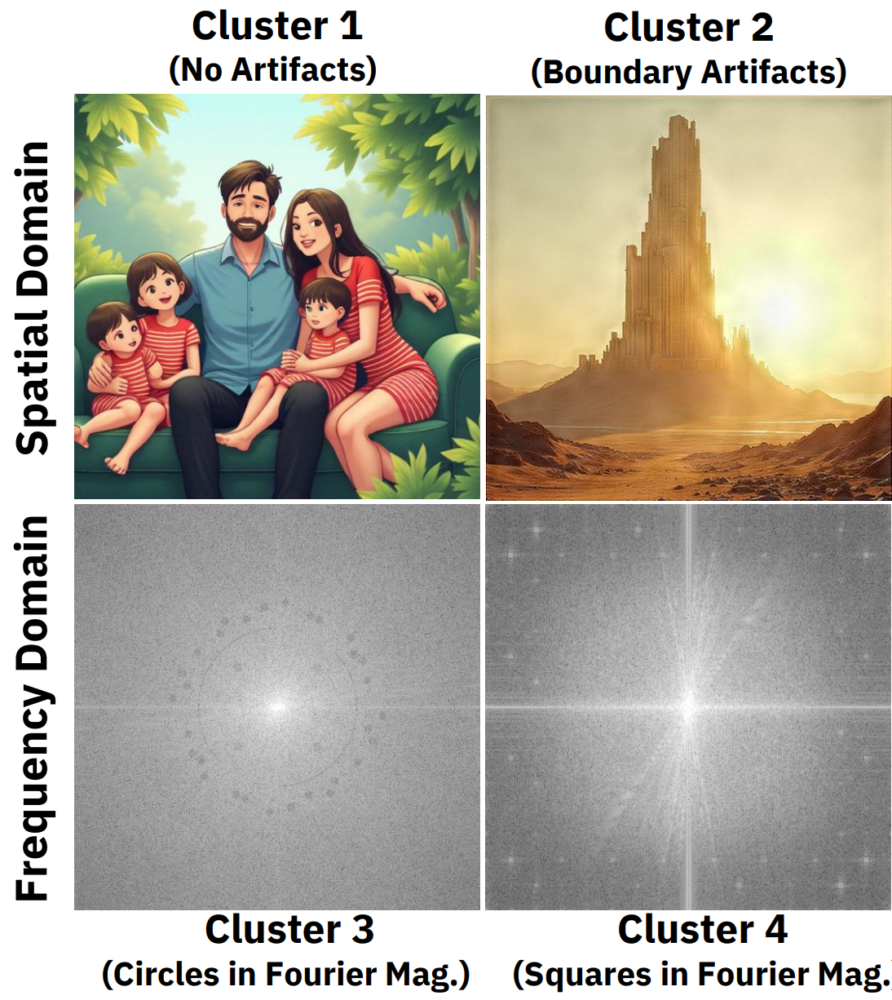

# Watermark Analysis

This repository contains code for analyzing and attacking invisible image
watermarking schemes. It accompanies our **first-place solution** to the
**NeurIPS 2024 *Erasing the Invisible* Stress-Test Challenge for Image
Watermarks** (workshop on GenAI Watermarking, ICLR 2025). The paper is
included in [`assets/60_First_Place_Solution_to_Neu.pdf`](assets/60_First_Place_Solution_to_Neu.pdf).

The project implements watermark encoders / decoders (RivaGAN, StegaStamp,
DWT-DCT, DWT-DCT-SVD, Tree-Ring), a suite of removal attacks (distortion,
regeneration via learned image compressors and diffusion refiners,
embedding-space PGD, and an adaptive VAE-based attack fine-tuned against a
specific watermark), and quality / performance metrics to evaluate the
trade-off between watermark removal and perceptual fidelity.

## Highlights

Our pipeline secured first place in both the **black-box** and **beige-box**
tracks of the challenge.



*Final leaderboard: Team-MBZUAI ranks first in both tracks of the NeurIPS 2024
Erasing the Invisible challenge.*


*Qualitative results: top row shows original watermarked images, bottom row
shows images after our removal attack. Perceptual fidelity is preserved while
the watermark is erased.*

## Method Overview

### Beige-box track: adaptive VAE attack

For the beige-box setting (watermarking algorithm known, key unknown), we
generate paired (watermarked, inverse-watermarked) data from Stable Diffusion
2.1 with publicly available prompts, then fine-tune the SDXL-Refiner VAE to
map a watermarked input to its inverse-watermarked counterpart under an MSE
loss. This is followed by per-image test-time optimization (LPIPS + SSIM
losses) and CIELAB color/contrast transfer to restore visual quality.



*Overview of the dataset-generation (paired watermarked / inverse-watermarked
images) and VAE fine-tuning stages of the beige-box attack.*

### Black-box track: cluster-specific diffusion regeneration

For the black-box setting, watermarked images are clustered by spatial and
frequency-domain artifacts, and a cluster-specific removal strategy is
applied. The main component is an image-to-image diffusion attack using the
Stable Diffusion Refiner with ChatGPT-generated semantic captions.



*Diffusion-based regeneration pipeline: the watermarked image is encoded,
forward-diffused, and denoised by the UNet conditioned on a ChatGPT-generated
caption describing the original content.*



*Cluster analysis for the black-box track: images fall into four groups
based on spatial artifacts and Fourier-magnitude signatures (no artifacts,
boundary artifacts, circular patterns, square patterns). Each cluster
receives a tailored attack configuration.*

## Repository Structure

```
watermark-analysis/
|- pyproject.toml                    # Package + console_scripts entry points
|- README.md
|- assets/                           # Paper PDF and figures used in this README
|- data/
|   |- coco.json                     # COCO captions used as generation prompts
|- notebooks/                        # Exploratory notebooks (trw, test_metrics, ...)
|- scripts/                          # Thin CLI wrappers (argparse -> package code)
|   |- generate_prompts.py
|   |- create_dataset.py             # --split test | attack
|   |- train_adaptive_attack.py
|   |- apply_adaptive_attack.py
|   |- eval_performance.py           # BER, AUC-ROC, significance thresholds
|   |- eval_quality.py               # LPIPS / MSE / PSNR / SSIM / NMI / FID
|   |- inspect_onnx.py
|   |- parallel_performance.sh
|   |- parallel_quality.sh
|- src/watermark_analysis/
|   |- config.py                     # Centralised paths, seeds, model names
|   |- io.py                         # Image listing / loading helpers
|   |- prompts.py                    # COCO-caption iterator
|   |- datasets.py                   # Test / attack dataset generation
|   |- cli.py                        # Console-script entry points
|   |- watermarks/                   # Watermark encoders/decoders
|   |   |- base.py                   # ABC Watermark
|   |   |- registry.py               # WATERMARKS dict
|   |   |- dwt_dct.py rivagan.py stegastamp.py
|   |   |- trw.py trw_stable_diffusion.py
|   |   |- modified_sd_pipeline.py post_processing_sd.py
|   |- attacks/                      # Removal attacks
|   |   |- base.py registry.py
|   |   |- distortion.py regeneration.py adversarial.py
|   |   |- adaptive/                 # VAE attack (model / train / apply)
|   |- metrics/
|       |- performance.py            # BER / AUC / detection ROC helpers
|       |- quality/                  # image, perceptual, distributional, folder compare
```

## Installation

The code targets Python 3.10+ and CUDA-enabled PyTorch.

```bash
pip install -e .
```

Dependencies are declared in `pyproject.toml` (torch, torchvision,
diffusers, transformers, onnxruntime, opencv-python, Pillow, numpy, pandas,
tqdm, wandb, scikit-learn, scikit-image, scipy, lpips, clean-fid,
pytorch-fid, pywavelets, compressai, matplotlib).

The RivaGAN and StegaStamp encoders rely on ONNX model files
(`rivagan_encoder.onnx`, `rivagan_decoder.onnx`, `stega_stamp.onnx`). Place
them under `watermarks/` at the repo root, or set `WATERMARK_ONNX_DIR` to
their containing directory.

After `pip install -e .` the following console scripts become available:
`wm-create-dataset`, `wm-train-adaptive`, `wm-apply-adaptive`,
`wm-eval-performance`, `wm-eval-quality`, `wm-inspect-onnx`,
`wm-generate-prompts`. Each is equivalent to running the matching file
under `scripts/` with `python`.

## Usage

### 1. Generate a watermarked test dataset

```bash
python scripts/create_dataset.py --split test --watermark dwtdctsvd
```

Creates 1024 watermarked images (batch size 16) under
`cache/test_dataset_<algorithm>/` with a `messages.csv` mapping each image
to its embedded bit-string. Supported algorithms:
`rivagan`, `dwtdct`, `dwtdctsvd`, `stegastamp`, `trw`.

### 2. Generate paired attack-training data

```bash
python scripts/create_dataset.py --split attack --watermark dwtdct
```

Produces triplets `(no_watermark, watermark, inverse_watermark)` under
`cache/attack_dataset_<algorithm>/`, used to train the adaptive VAE attack.

### 3. Train the adaptive VAE attack

```bash
python scripts/train_adaptive_attack.py \
    --cache-dir cache/attack_dataset_dwtdct \
    --mode no_watermark --alpha 1 --beta 0
```

Fine-tunes an `AutoencoderKL` (SDXL-Refiner VAE) with an LPIPS + MSE loss
to map watermarked inputs to clean / inverse-watermarked targets. Runs log
to W&B; checkpoints land under `training_runs/run_<timestamp>/`.

### 4. Apply the trained attack to new images

```bash
python scripts/apply_adaptive_attack.py \
    --input-folder path/to/watermarked \
    --output-folder path/to/attacked \
    --vae-path training_runs/run_<timestamp>/models/best_model.pth
```

### 5. Other attacks

Distortion, regeneration, and adversarial PGD attacks are importable from
`watermark_analysis.attacks`:

```python
from watermark_analysis.attacks import (
    DistortionAttacks, VAEAttack, DiffuserAttack, adv_emb_attack,
)
```

`DistortionAttacks().process_directory(src, dst)` applies each distortion
type under `DEFAULT_DISTORTION_STRENGTHS`; `adv_emb_attack(src, encoder,
strength, dst)` runs the warm-up PGD embedding attack.

### 6. Evaluate

```bash
# Watermark-decoding performance (BER, AUC, significance thresholds)
python scripts/eval_performance.py \
    --images_path path/to/attacked \
    --csv_path cache/test_dataset_<algorithm> \
    --algorithm <rivagan|stegastamp|dwtdct|dwtdctsvd>

# Image-quality metrics (LPIPS / MSE / PSNR / SSIM / NMI / FID)
python scripts/eval_quality.py \
    --ref_folder path/to/watermarked \
    --target_folder path/to/attacked
```

Parallel wrappers are provided in `scripts/parallel_performance.sh` and
`scripts/parallel_quality.sh`.

## Citation

If you use this code or the attack methodology, please cite:

```bibtex
@inproceedings{shamshad2025erasing,
  title     = {First-Place Solution to NeurIPS 2024 Invisible Watermark Removal Challenge},
  author    = {Shamshad, Fahad and Bakr, Tameem and Shaaban, Yahia and
               Hussein, Noor and Nandakumar, Karthik and Lukas, Nils},
  booktitle = {1st Workshop on GenAI Watermarking, collocated with ICLR 2025},
  year      = {2025}
}
```

Paper: [`assets/60_First_Place_Solution_to_Neu.pdf`](assets/60_First_Place_Solution_to_Neu.pdf).
